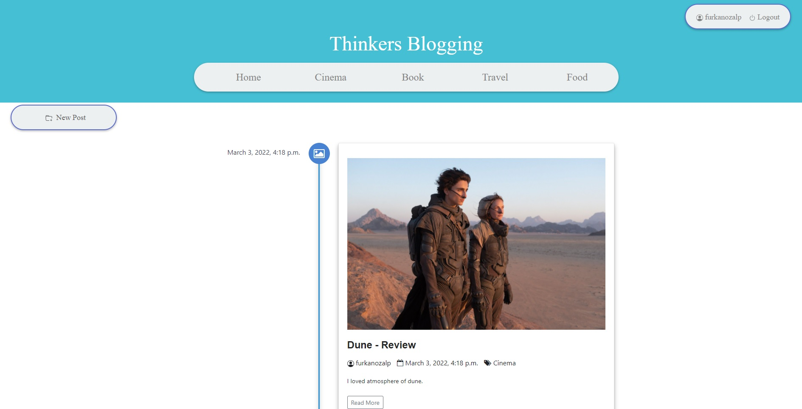

# Bloggers website

## ABOUT
- Basic bloggers website with simple and beautiful theme by different categories.


## INSTALLATION

See the requirements file for installation packages;

```pip install -r requirements.txt```

### Manual installation of packages

```pip install Django django-crispy-forms pillow django-ckeditor```

- **NOTE** If you want to use registration with social medias install django auth social.

## FEATURES
- Include different categories by using timeline.
- Include register/login methods.
- Easy to editable and improvable.
- For more information about Features please see **Photos** folder.
