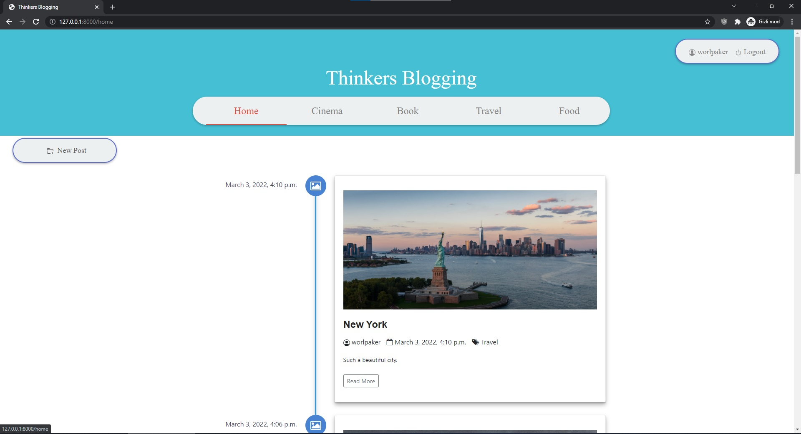
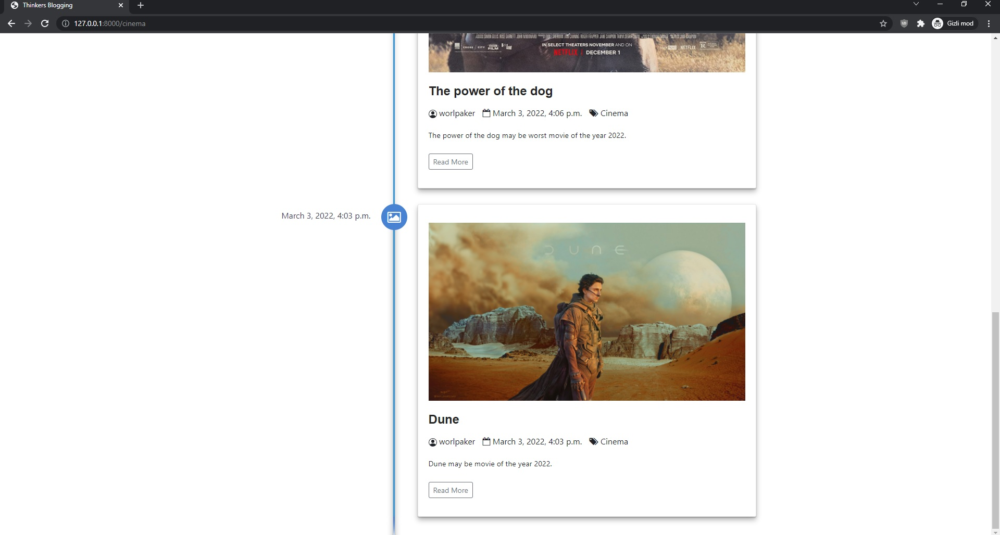

# Blogging web site by categories, Web site

## ABOUT
- Basic bloggers web site with simple and beautiful theme.

- **Please see: Features**

## INSTALLATION

- This program require python, you must install python first.

**NOTE: Highly recommend to run into virtual environment(venv).**

See the requirements file for installation packages;

> pip install -r requirements.txt

### Manual installation of packages

>pip install Django

>pip install django-crispy-forms

>pip install pillow

>pip install django-ckeditor

- **NOTE** If you want to use registration with social media install django auth social.

## FEATURES
- Include different categories by using timeline.
- Include register/login methods.
- Easy to editable and improvable.
- For more information please see **Photos** folder.

